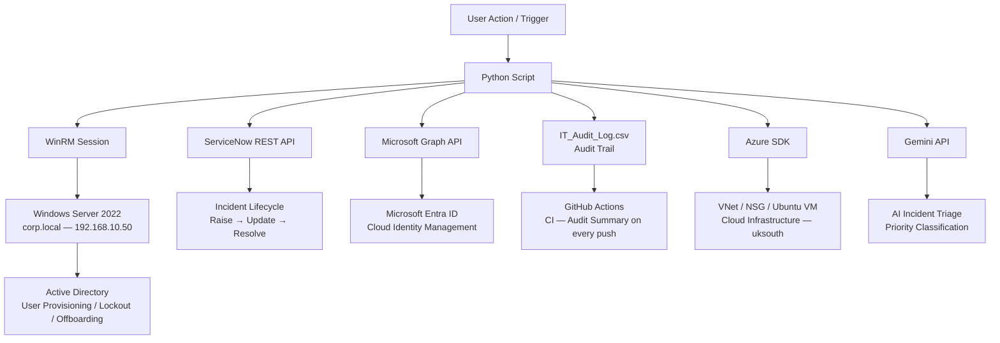
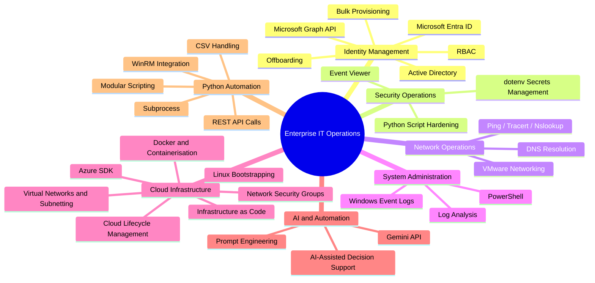

# Enterprise IT Operations and Workflow

An enterprise-style IT operations lab demonstrating realistic Active Directory, Entra ID, Azure, ServiceNow, and AI-assisted tooling workflows using industry-standard operational practices.

Built and maintained by Jesse Adejoh.

       

---

## Architecture

---

## Key Achievements

- Automated AD user provisioning, bulk onboarding, lockout resolution, and offboarding via Python and WinRM against Windows Server 2022
- Provisioned Azure VNets, subnets, and NSGs programmatically via Azure SDK with automated teardown to maintain zero ongoing cost
- Bootstrapped Azure B1s Ubuntu VMs via Python, injecting bash health check scripts on boot via custom data
- Built an MFA compliance auditor using Microsoft Graph API, containerised with Docker for portable deployment
- Integrated Gemini API for AI-assisted incident triage, parsing audit logs and classifying incidents by priority
- Integrated ServiceNow REST API for full incident lifecycle management across every automated workflow
- Implemented GitHub Actions CI pipeline posting audit summaries on every push to main

---

## Technologies

| Category | Technologies |
|---|---|
| Identity | Active Directory, Microsoft Entra ID, Microsoft Graph API |
| Cloud | Azure SDK, Azure VMs, VNet, NSG |
| Scripting | Python, PowerShell |
| ITSM | ServiceNow REST API |
| Security | MFA Compliance, Conditional Access, Docker |
| CI/CD | GitHub Actions |
| Infrastructure | VMware, Windows Server 2022, Linux, WinRM |
| AI | Gemini API |

---

## Workflow Catalogue

Every workflow follows real support ticket discipline — where Python can genuinely automate something, it does. Where it can't, the task is done manually and logged.

| Workflow | Category | Status |
|---|---|---|
| New Starter Provisioning | Identity Management | Complete |
| Bulk User Provisioning from CSV | Identity Management | Complete |
| Group Membership and RBAC | Identity Management | Complete |
| Account Lockout Investigation | Identity Management | Complete |
| Offboarding Workflow | Identity Management | Complete |
| Entra ID User Lifecycle via Graph API | Identity Management | Complete |
| Python Script Hardening | Security Operations | Complete |
| Connectivity Troubleshooting | Network Operations | Complete |
| DNS Health Check and Public Record Audit | Network Operations | Complete |
| Azure Network Provisioning and Security | Cloud Infrastructure | Complete |
| Linux VM Bootstrap and Health Check | Cloud Infrastructure | Complete |
| MFA Compliance Audit with Docker | Cloud Infrastructure | Complete |
| PowerShell Log Analysis | System Administration | Complete |
| AI-Assisted Incident Triage | System Administration | Complete |
| Shift Simulation | Capstone | Complete |

---

## Skills Covered

---

## Audit Trail

Every task produces a log row in `logs/IT_Audit_Log.csv` using `scripts/logger.py`. Automated tasks capture the ServiceNow INC number directly from the API response and resolve the incident upon completion. Manual tasks use the logger script from the terminal with the INC number noted from the PDI.

For full environment setup, script inventory, dependencies, and configuration details see [SETUP.md](SETUP.md).

This environment is actively maintained. New workflows are added as skills develop.

An enterprise-style IT operations lab demonstrating realistic Active Directory, Entra ID, Azure, ServiceNow, and AI-assisted tooling workflows using industry-standard operational practices.

Built and maintained by Jesse Adejoh.

       
