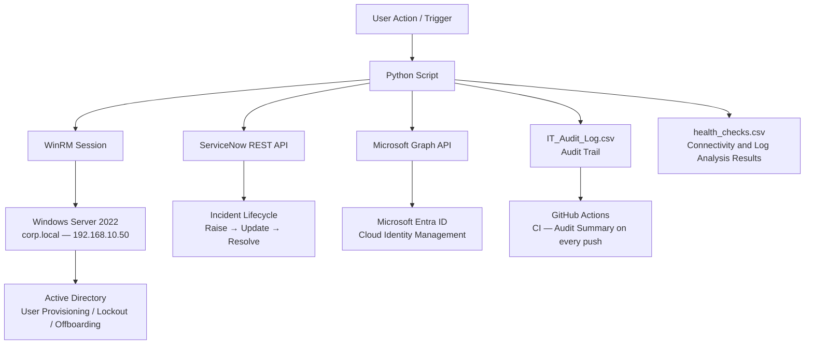
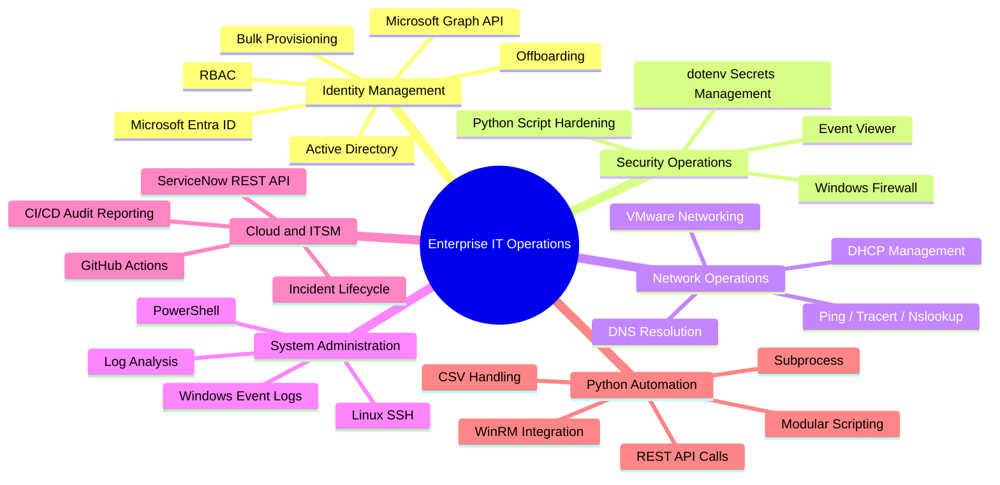

# Enterprise IT Operations and Workflow
A fully automated IT operations environment simulating real MSP workflows across Active Directory, ServiceNow, Microsoft Entra ID, and cloud infrastructure. Every workflow follows real support ticket discipline — where Python can genuinely automate something, it does. Where it can't, the task is done manually and logged.

Built and maintained by Jesse Adejoh.

       

---

## Architecture



---

## Key Outcomes
*   **Production-Ready IT Automation:** Replaced repetitive tier-1 helpdesk tasks with robust Python scripts utilizing WinRM and Microsoft Graph API.
*   **ITSM Alignment:** Integrated every automated script directly with the ServiceNow REST API to enforce enterprise ticket compliance automatically.
*   **Hardened Environments:** Implemented strict input validation, centralized `.env` secret token management, and structured error handling to prevent script failures from polluting live logs.
*   **Continuous Audit Control:** Engineered a live CI pipeline via GitHub Actions that automatically generates and posts data-driven audit summaries on every code push.

---

## Environment

| Component | Details |
|---|---|
| Windows Server 2022 | 192.168.10.50 — corp.local domain |
| Windows 11 VM | 192.168.10.60 — DESKTOP-QL161MH |
| Ubuntu Linux VM | IP confirmed at task time |
| ServiceNow PDI | dev268884 |
| Microsoft Entra ID | Free tier — managed via Azure Portal and Graph API |
| Hypervisor | VMware Workstation |

---

## Script Inventory

| File | Purpose |
|---|---|
| .github/workflows/audit_summary.yml | CI — Audit log summary posted on every push to main |
| .gitignore | Excludes .env and credentials from version control |
| csv-inputs/new_starters.csv | Day 7 — Sample bulk provisioning input file |
| LOGGING.md | Full schema and rules for IT_Audit_Log.csv and health_checks.csv |
| logs/evidence/ | Stores raw output from connectivity and health checks |
| scripts/auto_unlock.py | Day 6 — AD lockout detection and unlock via WinRM |
| scripts/bulk_provision.py | Day 7 — Bulk AD user provisioning from CSV |
| scripts/connectivity_check.py | Day 2 — Ping, nslookup, tracert, evidence saving, health log |
| scripts/dns_audit.py | Day 9 — Automates external DNS record lookup (A, MX, PTR) and captures evidence |
| scripts/entra_lookup.py | Day 8 — Queries Entra ID via Graph API to verify live user statuses and assigned licensing |
| scripts/entra_provision.py | Day 8 — Provisions contractor identities directly into cloud-native Entra ID using Graph API |
| scripts/log_analyser.py | Day 10 — Parses exported Windows Server event log CSVs via Python to isolate system errors |
| scripts/logger.py | Shared audit logging module — used by every script |
| scripts/offboard_user.py | Day 5 — Disables AD account, strips group memberships, moves to Disabled Users OU, and updates cloud identity |
| scripts/provision_user.py | Day 1 — AD user provisioning via WinRM |
| scripts/servicenow_api.py | Raises and resolves ServiceNow incidents via Table REST API |

Task scripts are written on the day each workflow is completed and pushed to GitHub immediately after.

---

## Identity Management

### New Starter Provisioning
Scenario: A new employee joins. Their AD account needs creating, assigned to the correct group, and a ServiceNow incident raised and resolved — all from a single command.

Workflow:
1. Open terminal in the project folder
2. Run the provisioning script:
```
python scripts/provision_user.py --first Sarah --last Blake --dept Sales --group Sales --password Welcome1!
```
3. The script connects to Windows Server via WinRM, creates the user in corp.local, adds them to the Sales group, raises a ServiceNow incident, captures the INC number, logs the full action to IT_Audit_Log.csv, and resolves the incident
4. Open Active Directory Users and Computers — confirm Sarah.Blake exists in the Users container
5. Check her Member Of tab — confirm she is in the Sales group
6. Open ServiceNow PDI — confirm the incident shows as Resolved with the correct INC number
7. Open logs/IT_Audit_Log.csv — confirm the row is there with the INC number populated
8. Push to GitHub

**What Python automates:** AD user creation via WinRM, group assignment, ServiceNow incident open and resolve, INC capture, audit logging

**Skills:** Active Directory, WinRM, Python, ServiceNow REST API, GitHub

---

### Bulk User Provisioning from CSV
Scenario: Five new starters join on the same day. A Python script reads a CSV and creates all accounts automatically.

Workflow:
1. Create csv-inputs/new_starters.csv with columns: FirstName, LastName, Department, Group, Password
2. Add five realistic entries
3. Run the bulk provisioning script:
```
python scripts/bulk_provision.py --csv csv-inputs/new_starters.csv
```
4. The script reads each row, creates the AD user via WinRM, logs a row per user, raises one ServiceNow incident covering the batch, and resolves it
5. Open Active Directory Users and Computers — confirm all five users exist
6. Open ServiceNow PDI — confirm the incident shows as Resolved
7. Open logs/IT_Audit_Log.csv — confirm five rows were logged
8. Push the CSV, script, and updated log to GitHub

**What Python automates:** CSV parsing, AD user creation for all rows, per-user logging, ServiceNow incident open and resolve, error handling for invalid rows

**Skills:** Python, Active Directory, WinRM, CSV handling, ServiceNow, GitHub

---

### Group Membership and Role-Based Access
Scenario: A user's role has changed. Update their group membership in Active Directory, verify the change with PowerShell, and log it.

Workflow:
1. Open Active Directory Users and Computers on Windows Server 2022
2. Find Sarah.Blake — right click > Properties > Member Of
3. Remove her from the Sales group
4. Click Add — type IT-Staff, click Check Names, click OK. Click Apply and OK
5. Open PowerShell on the server and verify:
```
Get-ADUser -Identity sarah.blake -Properties MemberOf | Select-Object MemberOf
```
6. Confirm IT-Staff appears in the output and Sales is removed
7. Open ServiceNow PDI — raise an Incident manually:
   - Category: Access
   - Short description: Group membership updated — Sarah Blake
   - Note the INC number
8. Run the logger with the INC number from step 7:
```
python scripts/logger.py --action GroupUpdate --status success --ticket [INC number] --actor Manual --target sarah.blake
```
9. Resolve the incident in ServiceNow PDI — set state to Resolved, add resolution note
10. Push to GitHub

**What Python does:** Logs the manual action

**Skills:** Active Directory, PowerShell, ServiceNow, Python logging, GitHub

---

### Account Lockout Investigation
Scenario: A user is locked out. Investigate the cause in Event Viewer, unlock the account via Python, and document it.

Workflow:
1. Open Event Viewer on Windows Server 2022 — Windows Logs > Security
2. Filter by Event ID 4625 — note the account name, failure reason, and source workstation
3. Run the auto unlock script:
```
python scripts/auto_unlock.py
```
4. The script queries AD for all locked accounts, unlocks each one, raises a ServiceNow incident, logs every action, and resolves the incident
5. Open PowerShell and verify:
```
Search-ADAccount -LockedOut | Select-Object Name, LockedOut
```
6. Confirm the output is empty
7. Open ServiceNow PDI — confirm the incident shows as Resolved
8. Open logs/IT_Audit_Log.csv — confirm the row is there
9. Push to GitHub

**What Python automates:** AD lockout query, account unlock, ServiceNow incident open and resolve, logging

**Skills:** Event Viewer, Active Directory, PowerShell, Python, ServiceNow, GitHub

---

### Offboarding Workflow
Scenario: An employee is leaving. Account disabled, groups cleared, account moved to Disabled Users OU — Python handles the full AD workflow.

Workflow:
1. Run the offboarding script:
```
python scripts/offboard_user.py --username sarah.blake
```
2. The script disables the account, removes all group memberships, moves it to the Disabled Users OU, raises a ServiceNow incident, logs the action, and resolves the incident
3. Open Active Directory Users and Computers and verify:
   - Account is disabled — icon shows a downward arrow
   - Member Of tab is empty
   - Account is in the Disabled Users OU
4. Open PowerShell and verify:
```
Get-ADUser -Identity sarah.blake -Properties Enabled, MemberOf
```
5. Confirm Enabled = False and MemberOf is empty
6. Open Entra ID > Users — confirm the account shows as blocked from sign-in
7. Open ServiceNow PDI — confirm the incident shows as Resolved
8. Push to GitHub

**What Python automates:** Account disable, group removal, OU move, ServiceNow incident open and resolve, logging

**Skills:** Active Directory, Entra ID, PowerShell, Python, ServiceNow, GitHub

---

### Entra ID User Lifecycle via Graph API
Scenario: A new contractor needs a cloud identity created and verified. Python handles the full workflow via Microsoft Graph API — no portal required.

Workflow:
1. Run the Entra ID provisioning script:
```
python scripts/entra_provision.py --display "Test Contractor" --upn testcontractor@yourdomain.onmicrosoft.com --password TempPass1!
```
2. The script authenticates to Graph API, creates the user in Entra ID, raises a ServiceNow incident, logs the action to IT_Audit_Log.csv, and resolves the incident
3. Open Entra ID > Users — confirm the account exists and shows as active
4. Run the lookup script to verify:
```
python scripts/entra_lookup.py --upn testcontractor@yourdomain.onmicrosoft.com
```
5. The script returns the user's display name, account status, and assigned licences
6. Open ServiceNow PDI — confirm the incident shows as Resolved with the correct INC number
7. Push to GitHub

**What Python automates:** Graph API authentication, user creation, account verification, ServiceNow incident open and resolve, audit logging

**Skills:** Microsoft Entra ID, Microsoft Graph API, Python, REST APIs, ServiceNow, GitHub

---

## Security Operations

### Firewall Rule Check and Remediation
Scenario: A service becomes unreachable. A firewall rule is suspected. Manually test, fix, verify, and document.

Workflow:
1. Open ServiceNow PDI — raise an Incident manually:
   - Category: Network
   - Short description: Firewall rule verified and restored — [date]
   - Note the INC number
2. Open Windows Firewall with Advanced Security on Windows Server 2022
3. Go to Inbound Rules — find the rule for WinRM (port 5985)
4. Disable the rule deliberately — right click > Disable Rule
5. From the Windows 11 VM, attempt a WinRM connection — confirm it fails:
```
Test-WSMan -ComputerName 192.168.10.50
```
6. Go back to Windows Server — re-enable the rule
7. Retry the connection from Windows 11 VM — confirm it works
8. Open PowerShell and verify:
```
Get-NetFirewallRule | Where-Object { $_.Enabled -eq 'True' } | Select-Object DisplayName, Direction, Action | Format-Table
```
9. Run the logger with the INC number from step 1:
```
python scripts/logger.py --action FirewallCheck --status success --ticket [INC number] --actor Manual --target WindowsServer2022
```
10. Resolve the incident in ServiceNow PDI
11. Push to GitHub

**What Python does:** Logs the manual action

**Skills:** Windows Firewall, PowerShell, Networking, Python logging, ServiceNow, GitHub

---

### Python Script Hardening
Scenario: The scripts built across the lab work but are not production ready. Add proper error handling, input validation, and secrets management.

Workflow:
1. Open scripts/provision_user.py
2. Wrap the main logic in a try/except block:
```python
try:
    # existing logic here
except Exception as e:
    log_action("ProvisionUser", "failure", "N/A", "provision_user.py", target, str(e))
    print(f"[ERROR] {e}")
```
3. Add input validation — if any required field is empty, raise a ValueError with a clear message
4. Confirm .env exists in the project root with all credentials. Confirm .env is in .gitignore
5. Confirm every script loads credentials via dotenv:
```python
from dotenv import load_dotenv
import os
load_dotenv()
server_ip = os.getenv("SERVER_IP")
```
6. Retest each hardened script — confirm it still works with values loading from .env
7. Run a deliberate failure — pass an empty field — confirm the script catches it and logs a failure row rather than crashing
8. Push hardened scripts to GitHub — confirm .env does not appear in the commit

**What Python does:** This entire day is Python focused

**Skills:** Python, Error Handling, Input Validation, Security Best Practices, dotenv, GitHub

---

## Network Operations

### Connectivity Troubleshooting
Scenario: A user reports they cannot reach a network resource. Run diagnostics, save evidence, document the outcome, and close the ticket.

Workflow:
1. Run the connectivity check script:
```
python scripts/connectivity_check.py --target 192.168.10.50
```
2. The script runs ping, nslookup, and tracert — saves raw output to logs/evidence/
3. Review the saved output — note whether the target was reachable and what DNS returned
4. If ping failed, open VMware Workstation and confirm both VMs are on Host-only adapter (VMnet2). Re-run the script after fixing
5. The script raises a ServiceNow incident automatically, logs a row to logs/health_checks.csv with the INC number, and resolves the incident with a summary
6. Open ServiceNow PDI — confirm the incident shows as Resolved
7. Open logs/health_checks.csv — confirm the row is there with the correct status and INC number
8. Push to GitHub

**What Python automates:** Ping, nslookup, tracert, evidence saving, ServiceNow incident open and resolve, health check logging

**Skills:** Networking, DNS, VMware, Python, ServiceNow, GitHub

---

### DNS and DHCP Verification
Scenario: A device is not resolving hostnames or receiving an IP. Verify DNS and DHCP are correctly configured on the server.

Workflow:
1. Open DNS Manager on Windows Server 2022 — Server Manager > Tools > DNS
2. Expand the server > Forward Lookup Zones > corp.local
3. Check that an A record exists for DESKTOP-QL161MH pointing to 192.168.10.60. If missing — right click the zone > New Host (A) — enter the name and IP
4. Open DHCP Manager — Server Manager > Tools > DHCP
5. Expand the server > IPv4 > Scope > Address Leases — confirm the Windows 11 VM has an active lease
6. On the Windows 11 VM, open Command Prompt:
```
ipconfig /all
nslookup DESKTOP-QL161MH
```
7. Confirm the IP, subnet, gateway, and DNS server match expected values
8. Open ServiceNow PDI — raise an Incident manually:
   - Category: Network
   - Short description: DNS and DHCP verified — [date]
   - Note the INC number
9. Run the logger with the INC number from step 8:
```
python scripts/logger.py --action DNSDHCPCheck --status success --ticket [INC number] --actor Manual --target 192.168.10.60
```
10. Resolve the incident in ServiceNow PDI
11. Push to GitHub

**What Python does:** Logs the manual action

**Skills:** DNS, DHCP, Windows Server, Networking, Python logging, GitHub

---

### DNS Health Check and Public Record Audit
Scenario: A client reports intermittent connectivity issues. Run a full external DNS audit to rule out misconfiguration — Python automates the checks and saves all evidence.

Workflow:
1. Run the DNS audit script against a target domain:
```
python scripts/dns_audit.py --domain yourdomain.com
```
2. The script runs nslookup for A, MX, and PTR records, checks whether the domain resolves correctly, saves all output to logs/evidence/, raises a ServiceNow incident, logs the result to logs/health_checks.csv, and resolves the incident
3. Review the saved evidence — note any missing or misconfigured records
4. Cross-reference against expected values — confirm MX records point to the correct mail server and A record resolves to the correct IP
5. Open ServiceNow PDI — confirm the incident shows as Resolved with findings in the resolution notes
6. Push evidence file, script, and log to GitHub

**What Python automates:** nslookup execution, record capture, evidence saving, health check logging, ServiceNow incident open and resolve

**Skills:** DNS, Networking, Python, Evidence Collection, ServiceNow, GitHub

---

## System Administration

### PowerShell Log Analysis
Scenario: Review system health by exporting Windows Event Logs with PowerShell and analysing them with Python to produce a summary.

Workflow:
1. Open PowerShell on Windows Server 2022 and export the last 20 system errors:
```
Get-EventLog -LogName System -EntryType Error -Newest 20 | Select-Object TimeGenerated, Source, Message | Export-Csv -Path C:\logs\system_errors.csv -NoTypeInformation
```
2. Copy system_errors.csv to your local project folder under logs/
3. Run the log analyser:
```
python scripts/log_analyser.py --input logs/system_errors.csv
```
4. The script counts total errors, identifies the top 3 sources, prints the most recent error, saves a summary to logs/health_checks.csv, raises a ServiceNow incident, and resolves it
5. Review the output — note any recurring sources worth investigating
6. Open ServiceNow PDI — confirm the incident shows as Resolved
7. Push everything to GitHub

**What Python automates:** CSV parsing, error counting, source analysis, summary output, ServiceNow incident open and resolve, logging

**Skills:** PowerShell, Python, Windows Event Logs, ServiceNow, GitHub

---

### Linux SSH and System Health Check
Scenario: A Linux server needs a routine health check. SSH in, check services, review disk and logs, and create a test user.

Workflow:
1. Boot your Ubuntu Linux VM in VMware Workstation
2. Note the IP — run `ip a` and find the inet address
3. From the Windows 11 VM, SSH in:
```
ssh username@[Linux VM IP]
```
4. Check the SSH service:
```
systemctl status ssh
```
5. Check disk usage:
```
df -h
```
6. Review the last 20 lines of the system log:
```
tail -20 /var/log/syslog
```
7. Create a test user and confirm:
```
sudo adduser testuser
grep testuser /etc/passwd
```
8. Back on your Windows machine, run the logger:
```
python scripts/logger.py --action LinuxHealthCheck --status success --ticket [INC number] --actor Manual --target [Linux VM IP]
```
9. Open ServiceNow PDI — raise an Incident manually, note the INC number, then resolve it
10. Push to GitHub

**What Python does:** Logs the manual action

**Skills:** Linux CLI, SSH, User Management, System Monitoring, VMware, Python logging, ServiceNow, GitHub

---

## Shift Simulation
Scenario: You are covering a support shift. Work through five tickets in order. Each one must be fully resolved and closed in ServiceNow before moving to the next. Log everything.

Ticket Queue:

| # | Type | Task |
|---|---|---|
| 1 | New starter | Create AD account for James.Okafor, department = Finance, assign to Finance group |
| 2 | Locked account | Sarah.Blake is locked out — check Event Viewer for Event ID 4625, run auto_unlock.py, verify with PowerShell |
| 3 | Connectivity | A user cannot reach the server — run connectivity_check.py against 192.168.10.50, review the evidence file, document findings |
| 4 | Offboarding | A contractor's account needs disabling — run offboard_user.py, verify in AD and Entra ID, confirm groups are cleared |
| 5 | Health check | Export system errors with PowerShell, run log_analyser.py, confirm no critical unresolved errors |

Rules:
- Raise a real ServiceNow Incident for each ticket
- Log every action to IT_Audit_Log.csv
- Resolve the ServiceNow ticket before moving to the next one
- Push everything to GitHub at the end with a single commit

**Skills:** Active Directory, Entra ID, PowerShell, Python, ServiceNow, Networking, Windows Server, GitHub

---

## Skills Covered



---

## Audit Trail
Every task produces a log row in logs/IT_Audit_Log.csv using scripts/logger.py. Automated tasks capture the ServiceNow INC number directly from the API response and resolve the incident upon completion. Manual tasks use the logger script from the terminal with the INC number noted from the PDI. See LOGGING.md for the full schema and rules.

This environment is actively maintained. New workflows are added as skills develop.
